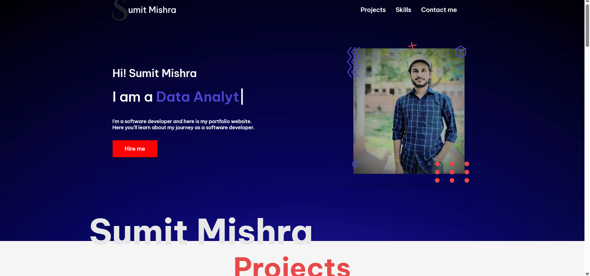

# 💼 Sumit Mishra – Developer Portfolio

Welcome to my personal portfolio website built with modern HTML, CSS, and JavaScript. This website is a showcase of my development skills, projects, and professional journey.

---

## 🚀 Features

- 🧑‍💻 Interactive hero section with dynamic typing (Typed.js)
- 🎨 Stylish and animated UI with smooth transitions
- 💼 Project showcase with tech stacks and links
- 🛠 Skill section with logos and custom animations
- 📱 Fully responsive and mobile-friendly
- 📬 Contact form to reach out directly

---

## 🛠 Tech Stack

- **HTML5**
- **CSS3** (+ custom animations)
- **JavaScript**
- **Font Awesome** for icons
- **Typed.js** for typing animation
- Responsive Design (Media Queries)

---

## 📂 Folder Structure

📁 portfolio-website/ ┣ 📄 index.html ┣ 📄 portfolio.css ┣ 📁 images/ ┃ ┣ 📁 UserAsset/ ┃ ┃ ┗ sumit.webp, IMAGE.png, etc. ┃ ┣ 📁 stack/ ┃ ┃ ┗ HTML.png, CSS.png, JS.svg, etc.

---

## 📸 Screenshots
  

---

## 🔗 Live Demo

[🌐 View Live Website](#) (https://submit52.github.io/Portfolio_code/)

---

## ✍️ About Me

Hi, I'm **Sumit Mishra**, a passionate developer currently exploring full stack development. This portfolio is a step toward showcasing my skills and projects built with technologies like React, Node.js, Express, MongoDB, and more.

---

## 📫 Contact Me

Have a question or want to work together?  
Use the contact form on the website or reach out via:

- [GitHub](https://github.com/suBmit52)
- [LinkedIn](https://www.linkedin.com/in/sumitmishra-here/)

---

> ⭐ Feel free to fork, customize, and use this as your own developer portfolio template!
